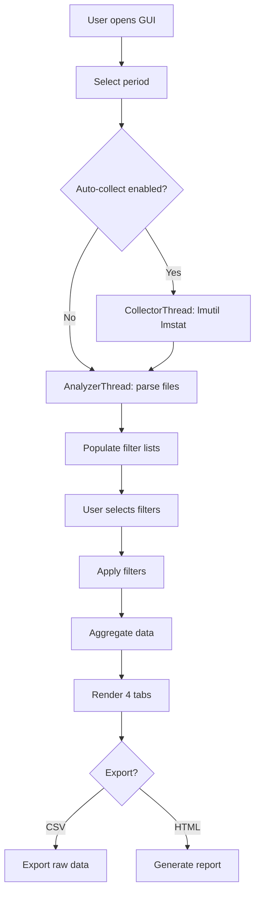

# License Monitor GUI - Technical Handoff Document

**Document Version:** 1.0
**Generated:** 2026-02-12
**Application:** `gui_license_monitor.py`
**Target Platform:** Windows 10 / PyQt5
**Python Version:** 3.12.2

---

## Executive Summary

The License Monitor GUI (`gui_license_monitor.py`) is a **PyQt5-based desktop application** that provides **real-time interactive analysis** of Synopsys FlexLM license usage data. Unlike the backend reporting system which generates static HTML reports, this GUI offers:

- **On-demand analysis** of any date range (no pre-computed reports)
- **Interactive filtering** by company, feature, and user
- **Live data collection** via `lmutil lmstat`
- **Multi-tab views**: Usage trends, statistics, user activity, raw details
- **Export capabilities**: CSV and self-contained HTML reports
- **Policy overlay**: Visual comparison of actual usage vs. allocated MAX limits

---

## Table of Contents

1. [Architecture Overview](#architecture-overview)
2. [Key Components](#key-components)
3. [Data Flow](#data-flow)
4. [User Interface Structure](#user-interface-structure)
5. [Core Algorithms](#core-algorithms)
6. [Configuration & Dependencies](#configuration--dependencies)
7. [Common Operations](#common-operations)
8. [Troubleshooting Guide](#troubleshooting-guide)
9. [Extension Points](#extension-points)
10. [Code Quality Notes](#code-quality-notes)

---

## Architecture Overview

### Design Philosophy

```
┌─────────────────────────────────────────────────────────┐
│  User selects period → On-demand file parsing → Filter  │
│  → Aggregate → Visualize (no pre-built database views)  │
└─────────────────────────────────────────────────────────┘
```

**Key differences from backend system:**
- **Backend**: Cron → DB ingestion → Pre-computed views → Static HTML
- **GUI**: User request → Parse raw files → In-memory aggregation → Live rendering

### Technology Stack

| Component | Technology | Purpose |
|-----------|-----------|---------|
| **GUI Framework** | PyQt5 | Windows, widgets, event handling |
| **Plotting** | Matplotlib (Qt5Agg backend) | Time-series charts embedded in PyQt |
| **Data Processing** | Pandas | Time-series aggregation, filtering |
| **Threading** | QThread | Background file parsing, lmstat collection |
| **Database** | SQLite3 | Policy data only (optional) |

### File Structure

```
gui_license_monitor.py (2500+ lines)
├─ Configuration (lines 44-58)
├─ LmstatParser (lines 64-151)
├─ PolicyLoader (lines 157-181)
├─ ConfigLoader (lines 188-218)
├─ AnalyzerThread (lines 224-262)
├─ CollectorThread (lines 268-321)
├─ IngestThread (lines 327-357)
├─ Aggregation helpers (lines 363-495)
├─ LicenseMonitorGUI (lines 517-2500+)
│  ├─ UI construction (541-898)
│  ├─ Period selection (1142-1235)
│  ├─ Analysis workflow (1239-1316)
│  ├─ Chart rendering (1497-1671)
│  ├─ Statistics table (1758-1865)
│  ├─ User activity table (1875-1929)
│  ├─ Details table (1933-1960)
│  ├─ Export CSV (1964-1991)
│  └─ Export HTML (1995-2500+)
```

---

## Key Components

### 1. LmstatParser (Static Methods)

**Purpose:** Parse raw `lmstat_YYYY-MM-DD_HH-MM-SS.txt` files into structured records.

**Key Methods:**
```python
@staticmethod
def scan_files(raw_dir, start_date, end_date)
    # Returns list of file paths matching date range

@staticmethod
def parse_file(filepath, user_company_map=None)
    # Returns: [{"ts": "2026-01-28 10:04:22", "feature": "...",
    #            "user": "...", "company": "...", "host": "..."}]
```

**Parsing Logic:**
1. Extract timestamp from filename: `lmstat_2026-01-28_10-04-22.txt` → `2026-01-28 10:04:22`
2. Scan for feature headers: `Users of FeatureName:  (Total of X licenses...`
3. Extract user checkouts: 4-space indent + ` start ` keyword
4. Derive company from user pattern: `hnlsi-nova` → company=`hnlsi`

**Critical Pattern:**
```python
# Line format detection (line 126):
if line.startswith("    ") and not line.startswith("      ") and " start " in line:
    tokens = line.split()
    user = tokens[0]
    host = tokens[1]
```

### 2. PolicyLoader

**Purpose:** Load per-user policy limits from `license_policy` table.

**Database Schema:**
```sql
CREATE TABLE license_policy (
    user TEXT,
    company TEXT,
    feature TEXT,
    policy_max INTEGER
)
```

**Aggregation Rule (lines 916-933):**
```
Per (company, feature): MAX(policy_max)
Then per feature: SUM across companies
```

**Example:**
```
hnlsi-nova, hnlsi, VCS_MX, 5
hnlsi-mike, hnlsi, VCS_MX, 3   → MAX(5,3) = 5
kteng-john, kteng, VCS_MX, 2   → MAX(2) = 2
                                  Total: 5+2 = 7
```

### 3. AnalyzerThread (Background Parser)

**Purpose:** Parse files in background to keep GUI responsive.

**Workflow:**
```python
def run(self):
    files = LmstatParser.scan_files(...)
    all_records = []
    for idx, fp in enumerate(files):
        recs = LmstatParser.parse_file(fp)
        all_records.extend(recs)
        self.progress.emit(int((idx+1)/total*100))

    df = pd.DataFrame(all_records)
    self.analysis_complete.emit(df, file_count)
```

**Signals:**
- `progress(int)`: 0-100 percentage
- `analysis_complete(DataFrame, int)`: Parsed data + file count
- `error_occurred(str)`: Error message

### 4. CollectorThread (Live lmstat)

**Purpose:** Run `lmutil lmstat` to collect a fresh snapshot.

**Command Construction (lines 287-290):**
```python
cmd = [self.lmutil, "lmstat"]
if self.lmstat_args:
    cmd += self.lmstat_args.split()  # e.g., ["-a"]
cmd += ["-c", self.server_spec]      # e.g., "27020@lic2"
```

**Output Handling:**
- **ONLY stdout** is written to file (line 298)
- **stderr is NEVER written** (would corrupt parser)
- Warns if output < 50 bytes (server unreachable)

### 5. Time Aggregation System

**Auto-Granularity Selection (lines 363-375):**
```python
def determine_granularity(start_date, end_date):
    delta = (end_date - start_date).days
    if delta <= 7:    return "5min"
    if delta <= 31:   return "hourly"
    if delta <= 93:   return "daily"
    if delta <= 365:  return "weekly"
    else:             return "monthly"
```

**Aggregation Logic (lines 391-438):**
```python
# Step 1: Count concurrent licenses per snapshot
per_snap = df.groupby(["ts", "time_bin", "feature"]).agg(
    concurrent=("user", "size")
).reset_index()

# Step 2: Peak concurrent per time bin
agg = per_snap.groupby(["time_bin", "feature"]).agg(
    concurrent=("concurrent", "max")
).reset_index()
```

**Gap Filling (lines 479-494):**
- Generates complete time-bin sequence
- Stops at current time (prevents chart extending past "Now")
- Fills missing bins with zero

---

## Data Flow

### Typical User Session



### Filter Cascade (Company → Feature/User)

**Special behavior (lines 1412-1453):**

When user selects companies, the GUI **auto-selects**:
1. **Users**: From both data + policy for selected companies
2. **Features**: From policy for selected companies

**Example:**
```
User selects company: [hnlsi]
→ Auto-select users: all data users + policy users for hnlsi
→ Auto-select features: all policy features for hnlsi
```

---

## User Interface Structure

### Main Window Layout

```
┌─────────────────────────────────────────────────────────────┐
│ Period Selection          │  Actions                        │
│ Start: [____] End: [____] │  [Collect Now] □ Auto-collect  │
│ Quick: [Weekly▾] [W03▾]   │  [Analyze] [Export CSV] [HTML] │
│                            │  [Ingest Lmstat] [Ingest Pol.] │
├─────────────────────────────────────────────────────────────┤
│ [█████████████████████████] Progress                        │
├──────────┬──────────────────────────────────────────────────┤
│ Filters  │ Tabs                                             │
│ ────────│                                                    │
│ Companies│ ┌─ Usage Trend ─┬─ Statistics ─┬─ User ─┬─ Det. │
│ (3/5)    │ │ Chart options: Type, Line, Width, Marker, ... │
│ [All][No]│ │ ┌──────────────────────────────────────────┐ │
│ □ hnlsi  │ │ │          [Chart Area]                    │ │
│ □ kteng  │ │ │                                          │ │
│ □ unknown│ │ └──────────────────────────────────────────┘ │
│ [Search] │ │                                              │
│          │ └──────────────────────────────────────────────┘
│ Features │
│ (2/8)    │
│ [All][No]│
│ □ VCS_MX │
│ □ Verdi  │
│ [Search] │
│          │
│ Users    │
│ (5/12)   │
│ [All][No]│
│ □ nova   │
│ [Search] │
└──────────┴──────────────────────────────────────────────────┘
│ Status: Analyzed 145 files, 3204 records | Period: 2026... │
└─────────────────────────────────────────────────────────────┘
```

### Tab Contents

| Tab | Content | Key Metrics |
|-----|---------|-------------|
| **Usage Trend** | Time-series chart | Concurrent licenses over time, policy MAX overlay |
| **Statistics** | Per-feature table | Total checkouts, unique users, active days, avg concurrent, peak, usage hours, utilization % |
| **User Activity** | Per-user table | Features used, checkouts, usage hours, sessions, avg hours/day |
| **Details** | Raw records | Timestamp, feature, user, company, host (first 10k rows) |

### Chart Options Bar

**Controls (lines 774-828):**
- **Type**: Area, Bar, Line, Step
- **Line Style**: Solid, Dashed, Dotted, Dash-dot
- **Width**: Thin, Medium, Thick
- **Marker**: Circle, Square, Triangle, Diamond, None
- **Font Size**: Small, Medium, Large, X-Large
- **Scale**: Auto, 5min, Hourly, Daily, Weekly, Monthly
- **Grid**: On/Off
- **Legend**: Best, Upper Right, Upper Left, Lower Right, Lower Left

---

## Core Algorithms

### 1. Snapshot Interval Detection (lines 1675-1697)

**Purpose:** Automatically detect collection frequency from data.

**Algorithm:**
```python
def _snapshot_interval_minutes(self):
    timestamps = pd.to_datetime(df["ts"]).dropna()
    unique_ts = sorted(timestamps.unique())
    if len(unique_ts) < 2:
        return 5  # default

    # Compute gaps between consecutive snapshots
    gaps = [(unique_ts[i] - unique_ts[i-1]).total_seconds() / 60
            for i in range(1, len(unique_ts))]

    # Use MEDIAN (robust against ad-hoc collections)
    median_gap = sorted(gaps)[len(gaps) // 2]
    return max(1.0, min(60.0, round(median_gap, 1)))
```

**Why median?** Robust against:
- One-off "Collect Now" button clicks
- Temporary cron disruptions
- Manual snapshot injections

### 2. Session Detection (lines 1700-1733)

**Purpose:** Group consecutive snapshots into usage sessions.

**Algorithm:**
```python
def _compute_sessions(ts_series, interval_min):
    unique_ts = sorted(ts_series.unique())
    gap_threshold = interval_min * 2.5  # 2.5x interval

    sessions = []
    session_start = unique_ts[0]
    session_end = unique_ts[0]

    for i in range(1, len(unique_ts)):
        if (unique_ts[i] - unique_ts[i-1]) > gap_threshold:
            # Gap detected → close current session
            duration = (session_end - session_start) + interval
            sessions.append(duration)
            session_start = unique_ts[i]
        session_end = unique_ts[i]

    # Close last session
    duration = (session_end - session_start) + interval
    sessions.append(duration)

    return len(sessions), sum(sessions)  # count, total_hours
```

**Example (5min interval, threshold=12.5min):**
```
10:00, 10:05, 10:10  → Session 1 (20min including final interval)
10:30, 10:35         → Session 2 (10min)
```

### 3. Utilization Metrics (lines 1827-1853)

**Active Utilization:**
```
Active Util. % = (Avg concurrent when in use) / Policy Max × 100
```
- **Numerator**: Average of concurrent counts (only snapshots with usage > 0)
- **Denominator**: Policy MAX
- **Color coding**: ≥80% green, ≥30% yellow, <30% red

**Period Utilization:**
```
Period Util. % = Usage Hours / (Policy Max × Period Hours) × 100
```
- **Numerator**: Total usage hours (session-based)
- **Denominator**: MAX × period hours (e.g., 7 days × 24 = 168 hours)
- **Color coding**: ≥60% green, ≥20% yellow, <20% red

**Example:**
```
Feature: VCS_MX
Policy Max: 10
Period: 7 days (168 hours)

Scenario 1:
- Usage hours: 84
- Avg concurrent when active: 3
→ Active Util. = 3/10 × 100 = 30% (yellow)
→ Period Util. = 84/(10×168) × 100 = 5% (red)

Scenario 2:
- Usage hours: 1200
- Avg concurrent when active: 8
→ Active Util. = 8/10 × 100 = 80% (green)
→ Period Util. = 1200/(10×168) × 100 = 71% (green)
```

### 4. Overuse Detection (lines 2157-2212)

**Purpose:** Identify when concurrent usage exceeded policy MAX.

**Algorithm:**
```python
def _build_overuse_analysis(df, policy_map):
    for feat in features:
        policy_max = policy_map.get(feat)
        snap_counts = df.groupby("ts").agg(concurrent=("user", "size"))

        over = snap_counts[snap_counts["concurrent"] > policy_max]
        if over.empty:
            continue  # no violation

        return {
            "feature": feat,
            "policy_max": policy_max,
            "peak_concurrent": max(snap_counts),
            "over_snapshots": len(over),
            "total_snapshots": len(snap_counts),
            "over_pct": len(over) / len(snap_counts) * 100,
            "est_duration": avg_interval × len(over),
            "max_excess": max(snap_counts) - policy_max
        }
```

**Output (HTML export):**
```
Feature      | Policy Max | Peak | Excess | Overuse % | Est. Duration
─────────────┼────────────┼──────┼────────┼───────────┼──────────────
VCS_MX       | 10         | 13   | +3     | 12.5%     | 3:45:00
Verdi_Ultra  | 5          | 7    | +2     | 8.2%      | 2:10:00
```

---

## Configuration & Dependencies

### Environment Variables

```bash
LICENSE_MONITOR_HOME=/home/appl/license_monitor
    ↓ Overrides default: Path(__file__).parent.parent
```

### Directory Structure (lines 48-54)

```python
BASE_DIR = Path(os.environ.get("LICENSE_MONITOR_HOME", ...))
RAW_DIR = BASE_DIR / "raw" / "lmstat"
DB_PATH = BASE_DIR / "db" / "license_monitor.db"
EXPORT_DIR = BASE_DIR / "exports"
```

### Config File Parsing (lines 188-218)

**File:** `conf/license_monitor.conf.csh`

**Parsed variables:**
```csh
setenv LMUTIL "/home/appl/synopsys/scl/2025.03/linux64/bin/lmutil"
setenv LM_SERVER "27020@lic2"
setenv LMSTAT_ARGS "-a"
setenv LMUTIL_USE_LICENSE_FILE "0"
setenv LICENSE_FILE "/path/to/license.txt"
```

**Variable resolution:**
```python
# Supports ${VAR} and $VAR expansion
val = "bin is ${SCL_BIN_DIR}/lmutil"
→ "bin is /home/appl/synopsys/scl/2025.03/linux64/bin/lmutil"
```

### Dependencies (PyQt5 + Scientific)

**Install command:**
```bash
pip install PyQt5 matplotlib pandas
```

**Import structure:**
```python
from PyQt5.QtWidgets import (QApplication, QMainWindow, QWidget, ...)
from PyQt5.QtCore import Qt, QDate, QThread, pyqtSignal
from PyQt5.QtGui import QColor

from matplotlib.backends.backend_qt5agg import FigureCanvasQTAgg
from matplotlib.figure import Figure
from matplotlib.dates import DateFormatter
import matplotlib.dates as mdates

import pandas as pd
import sqlite3
```

---

## Common Operations

### 1. Run the GUI

**Windows:**
```cmd
cd d:\Synopsys_support\license_monitor\license_monitor
C:\Users\...\python.exe bin\gui_license_monitor.py
```

**Linux (shebang configured):**
```bash
#!/usr/local/python-3.12.2/bin/python3.12
./bin/gui_license_monitor.py
```

### 2. Analyze a Period

**Steps:**
1. Set **Start** and **End** dates
2. Click **Analyze** button
   - Auto-collect runs if enabled (every analysis)
   - Progress bar shows parsing progress
3. Review 4 tabs
4. Adjust filters as needed (instant re-draw)

**Quick Period Selector:**
1. Select granularity: Weekly, Monthly, Quarterly, Yearly
2. Select period: Week-03, Month-08, Quarter-Q2, Year-2026
3. Analysis starts automatically

### 3. Export Data

**CSV Export:**
- Exports **filtered raw data** (current selection)
- Filename: `YYYYMMDD_HHMMSS_startdate_enddate.csv`
- Columns: ts, feature, user, company, host

**HTML Export:**
1. Click **Export HTML** button
2. Wait for report generation (progress animation)
3. Report saved to `exports/` directory
4. Click **View HTML** button to open in browser
   - Opens automatically in default web browser
   - Works with Chrome, Firefox, Edge, Safari
   - Button disabled until first export

**Features:**
- Self-contained report (embedded chart as base64 PNG)
- Includes: Summary cards, feature stats, company breakdown, cross-tab matrix, top users, overuse alerts
- **Per-company tabs** for multi-company analysis
- Filename: `license_report_YYYYMMDD_HHMMSS_period.html`

### 4. Collect Fresh Snapshot

**Manual:**
1. Click **Collect Now**
2. Waits for lmstat completion (~5-30 seconds)
3. File saved: `raw/lmstat/lmstat_2026-02-12_14-35-22.txt`

**Auto-collect:**
1. Enable checkbox
2. Every **Analyze** click triggers collection first
3. Then proceeds to parsing

### 5. Ingest Operations

**Ingest Lmstat:**
- Runs `bin/ingest_lmstat.py` in background
- Loads raw files → `lmstat_snapshot` table
- Needed only if using DB-based reports (not required for GUI)

**Ingest Policy:**
- Runs `bin/ingest_policy.py` in background
- Parses `bin/options.opt` → `license_policy` table
- **Required** if policy overlay feature is used

---

## Troubleshooting Guide

### Common Issues

#### 1. "No data available" in chart

**Symptoms:**
- Chart shows gray text instead of data
- Statistics table is empty

**Causes & Solutions:**

| Cause | Check | Solution |
|-------|-------|----------|
| No files in date range | Status bar shows "0 files" | Expand date range or collect data |
| All filters cleared | Filter counts show (0/N) | Re-select filters or click "All" |
| Company filter cascade | Features auto-cleared | Manually re-select features |
| Parse errors | Check raw file format | Verify lmstat output structure |

#### 2. Collection fails

**Error message:** "lmutil not found"

**Fix:**
```csh
# Check conf/license_monitor.conf.csh
setenv LMUTIL "/correct/path/to/lmutil"
```

**Error message:** "Collected file appears empty"

**Causes:**
- License server down: `ping lic2`
- Port blocked: `telnet lic2 27020`
- Wrong server spec: Check `LM_SERVER` value

**Debug:**
```bash
# Manual test
/path/to/lmutil lmstat -a -c 27020@lic2
```

#### 3. Policy overlay not showing

**Symptoms:**
- No dashed horizontal lines in chart
- "Policy Max" column shows "-"

**Causes:**
1. **No policy data**: Database missing or empty
2. **User mismatch**: Policy users ≠ data users
3. **Company filter**: Selected company has no policy

**Fix:**
1. Run "Ingest Policy" button
2. Check database:
   ```sql
   SELECT COUNT(*) FROM license_policy;
   SELECT DISTINCT company FROM license_policy;
   ```

#### 4. Performance issues (slow parsing)

**Symptoms:**
- Progress bar takes > 30 seconds
- GUI freezes during analysis

**Causes:**
- Large date range (e.g., 1 year = 100k+ files)
- Network-mounted raw directory
- Low memory (< 4GB available)

**Solutions:**
1. **Reduce range**: Analyze smaller periods
2. **Local copy**: Copy raw files to local disk
3. **Increase memory**: Close other apps
4. **Batch analysis**: Use backend reports for large ranges

#### 5. Chart X-axis compression

**Symptoms:**
- X-axis labels overlap
- Chart area extends beyond "Now"

**Cause:** Granularity too fine for period (e.g., 5min for 1 year)

**Fix:**
- Use **Scale** dropdown: Select "Daily" or "Weekly"
- Or use Quick Period selector (auto-scales)

---

## Extension Points

### 1. Add New Metric

**Example:** Add "Denial Count" to Statistics table

**Steps:**
1. Modify `_update_stats()` (line 1758):
   ```python
   # After line 1792
   denials = fdf[fdf["status"] == "DENIED"].shape[0]
   ```

2. Add column header (line 839):
   ```python
   self.stats_table.setHorizontalHeaderLabels([
       ..., "Denials"
   ])
   ```

3. Insert cell (line 1822):
   ```python
   self.stats_table.setItem(row_idx, 12, self._make_numeric_item(denials))
   ```

### 2. Add New Chart Type

**Example:** Add stacked area chart

**Steps:**
1. Add option (line 778):
   ```python
   self.chart_type_cb.addItems(["Area", "Bar", "Line", "Step", "Stacked Area"])
   ```

2. Implement rendering (line 1598):
   ```python
   elif ct == "stacked_area":
       ax.stackplot(x_values, *y_values_per_feature, labels=features, alpha=0.7)
   ```

### 3. Add Export Format

**Example:** Add Excel export

**Steps:**
1. Add button (line ~635):
   ```python
   self.export_excel_btn = QPushButton("Export Excel")
   self.export_excel_btn.clicked.connect(self._export_excel)
   action_row2.addWidget(self.export_excel_btn)
   ```

2. Implement method:
   ```python
   def _export_excel(self):
       if self.filtered_data is None:
           return
       file_path, _ = QFileDialog.getSaveFileName(
           self, "Export to Excel", "export.xlsx",
           "Excel Files (*.xlsx);;All Files (*)"
       )
       if file_path:
           self.filtered_data.to_excel(file_path, index=False)
   ```

**Reference Implementation:**
- See `_view_html()` method (added 2026-02-12) for example of:
  - Tracking last exported file path
  - Enabling/disabling button based on state
  - Opening file with external program
  - Error handling for missing files

### 4. Add Real-Time Monitoring

**Example:** Auto-refresh every 5 minutes

**Steps:**
1. Add timer in `__init__()`:
   ```python
   self.auto_refresh_timer = QTimer(self)
   self.auto_refresh_timer.timeout.connect(self._run_analyze)
   ```

2. Add control:
   ```python
   self.auto_refresh_cb = QCheckBox("Auto-refresh (5min)")
   self.auto_refresh_cb.toggled.connect(
       lambda checked: self.auto_refresh_timer.start(300000) if checked
                       else self.auto_refresh_timer.stop()
   )
   ```

---

## Code Quality Notes

### Strengths

✅ **Separation of concerns:**
- Parser logic isolated in static methods
- Threading for long operations
- Qt signals/slots for async updates

✅ **Robust error handling:**
- Try/catch in file parsing (line 147)
- Subprocess timeouts (line 293, 346)
- Empty data checks throughout

✅ **User experience:**
- Progress feedback during parsing
- Instant filter updates (no re-parse)
- Button color/animation for state feedback
- Search boxes for filter lists

✅ **Chart features:**
- Auto-scaling X-axis
- Policy overlay with matching colors
- "Now" marker prevents future extension
- Configurable appearance

### Areas for Improvement

⚠️ **Large file handling:**
- Details tab limited to 10k rows (line 1941)
- No pagination for Statistics/User Activity
- Memory grows linearly with date range

**Recommendation:** Add pagination or virtual scrolling for tables.

⚠️ **Error messages:**
- Generic "Collection error" (line 1000)
- No distinction between network vs. config issues

**Recommendation:** Add error codes and specific troubleshooting hints.

⚠️ **Configuration validation:**
- Missing file paths fail silently
- No validation of server spec format

**Recommendation:** Add startup validation with user-friendly error dialog.

⚠️ **Code duplication:**
- Similar aggregation logic in multiple methods
- Stats table and HTML export repeat calculations

**Recommendation:** Extract shared logic into helper methods.

### Security Considerations

🔒 **Subprocess execution:**
- Uses `subprocess.run()` with list args (safe, no shell injection)
- Timeout set (prevents hang)
- Only stdout written to file (stderr isolated)

🔒 **File operations:**
- No user-controlled file paths in parsing
- Export uses QFileDialog (sandbox)
- No eval() or exec() usage

🔒 **Database:**
- Read-only queries (no user SQL input)
- Optional dependency (graceful degradation)

---

## Quick Reference

### Key Keyboard Shortcuts

| Action | Shortcut | Widget |
|--------|----------|--------|
| Select All | Ctrl+A | Filter lists (after focus) |
| Search | Type text | Filter search boxes |
| Clear search | Esc | Search boxes (if clear button clicked) |

### Status Bar Messages

| Message | Meaning | Action |
|---------|---------|--------|
| "Ready. Select a period..." | Initial state | Set dates, click Analyze |
| "Analyzed N files, M records" | Success | Review tabs |
| "Collecting lmstat snapshot..." | Running lmutil | Wait ~10-30 sec |
| "Collection disabled — conf not found" | Missing config | Check conf/license_monitor.conf.csh |
| "Error: ..." | Operation failed | Check message, see Troubleshooting |

### File Locations

| Type | Path | Purpose |
|------|------|---------|
| **Raw data** | `raw/lmstat/lmstat_*.txt` | Parsed by AnalyzerThread |
| **Database** | `db/license_monitor.db` | Policy data (optional) |
| **Config** | `conf/license_monitor.conf.csh` | lmutil settings |
| **Policy** | `bin/options.opt` | Source for policy ingestion |
| **Exports** | `exports/` | CSV/HTML outputs |
| **Logs** | `log/` | Collection/ingest logs (if enabled) |

---

## Contact & Maintenance

### Code Ownership

| Component | Primary Contact | Notes |
|-----------|----------------|-------|
| **Parser** | Lines 64-151 | Synopsys lmstat format dependent |
| **Policy** | Lines 157-181, 902-933 | Matches options.opt structure |
| **Charts** | Lines 1497-1671 | Matplotlib styling |
| **Export** | Lines 1995-2500+ | HTML report generation |

### Change Log Location

- Version history: Git commit log
- Documentation: This file (`HANDOFF.md`)
- Feature tracking: See `docs/02-design/` (if PDCA workflow used)

### Testing Recommendations

**Before deployment:**
1. Test with empty date range (no files)
2. Test with single-day range (minimal data)
3. Test with 1-month range (typical usage)
4. Test company filter cascade
5. Test policy overlay with/without database
6. Test export with special characters in usernames
7. Test collection with unreachable server

**Performance benchmarks:**
- 1000 files (~7 days at 5min): < 5 seconds
- 10000 files (~1 month at 5min): < 30 seconds
- 100000 files (~1 year at 5min): Use backend reports instead

---

## Appendix: Data Structure Examples

### Raw lmstat File Format

```
Users of VCS_MX:  (Total of 10 licenses issued;  Total of 3 licenses in use)

  "VCS_MX" v2024.12, vendor: snpslmd
  floating license

    hnlsi-nova server1 /dev/pts/1 (v2024.12) (lic2/27020 374275), start Wed 1/29 9:04
    hnlsi-mike server2 /dev/pts/2 (v2024.12) (lic2/27020 374275), start Wed 1/29 9:15
    kteng-john server3 /dev/pts/3 (v2024.12) (lic2/27020 374275), start Wed 1/29 10:22
```

### Parsed DataFrame Schema

```python
pd.DataFrame([
    {"ts": "2026-01-29 09:04:22", "feature": "VCS_MX", "user": "hnlsi-nova",
     "company": "hnlsi", "host": "server1"},
    {"ts": "2026-01-29 09:04:22", "feature": "VCS_MX", "user": "hnlsi-mike",
     "company": "hnlsi", "host": "server2"},
    {"ts": "2026-01-29 09:04:22", "feature": "VCS_MX", "user": "kteng-john",
     "company": "kteng", "host": "server3"},
])
```

### Aggregated Time Bins (5min granularity)

```python
pd.DataFrame([
    {"time_bin": "2026-01-29 09:00", "feature": "VCS_MX", "concurrent": 2},
    {"time_bin": "2026-01-29 09:05", "feature": "VCS_MX", "concurrent": 2},
    {"time_bin": "2026-01-29 09:10", "feature": "VCS_MX", "concurrent": 2},
    {"time_bin": "2026-01-29 10:20", "feature": "VCS_MX", "concurrent": 3},
])
```

---

**End of Handoff Document**

For questions or issues, refer to:
- Application source: `bin/gui_license_monitor.py`
- Backend system docs: `README.md`, `ARCHITECTURE.md`
- GUI-specific docs: `GUI_README.md`, `GUI_QUICKSTART.md`
